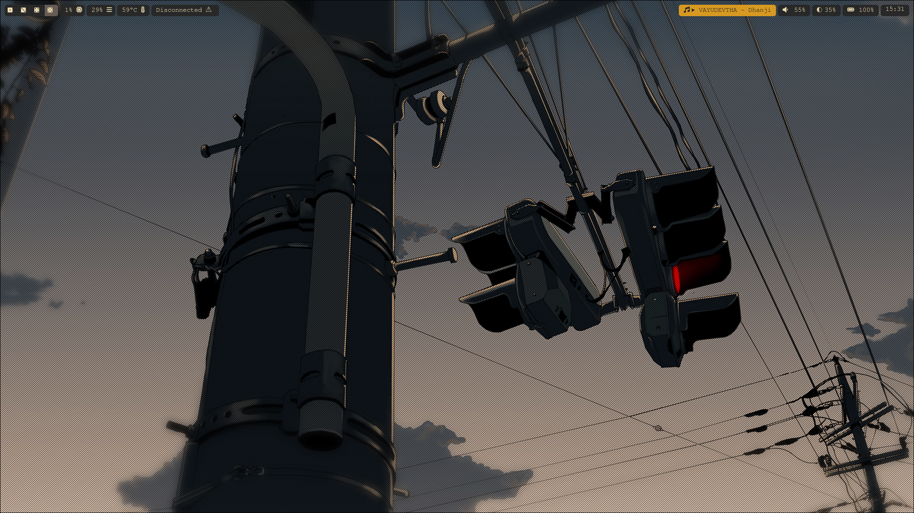

# .config

>[!WARNING]
> The config may not be the most optimal

> [!NOTE]
> These configs are tailored for my machine, might need some tweaking for yours (Feel free to use them)

My Personal Setup Dot files:  
OS : Arch Linux x86_64  
WM: Hyprland (Wayland)  
Terminal: kitty  
Bar: Waybar  
\+  
Hyprshot, Hyprlock, Nautilus, Pipewire (+Wireplumber), Wofi, Fastfetch   

>[!Tip]
> Install Hack Nerd Fonts

> [!Note]
> The keybindings can be found in /hypr/hyprland.conf

# Setup Images

